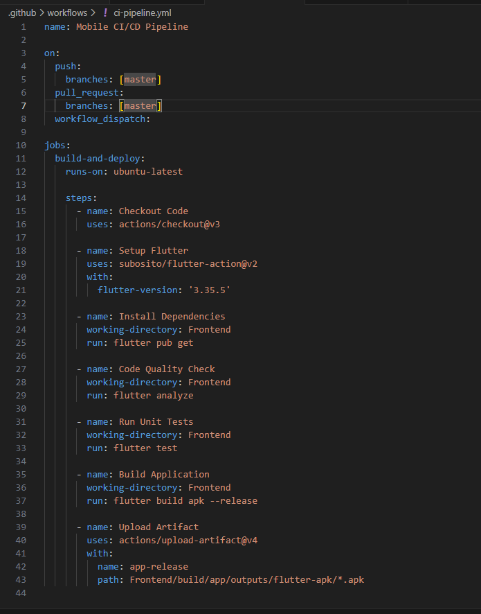
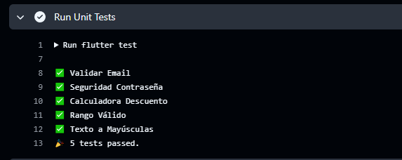
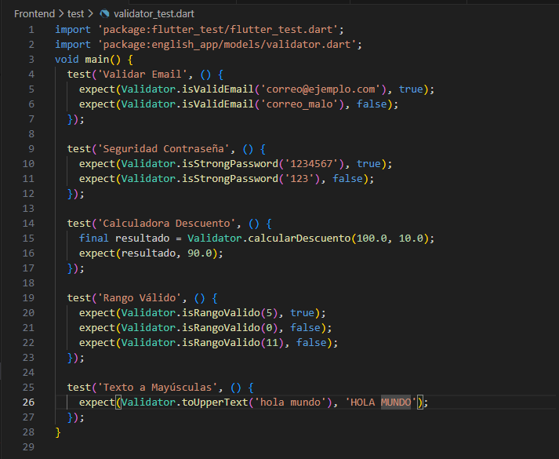
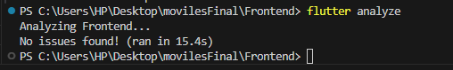
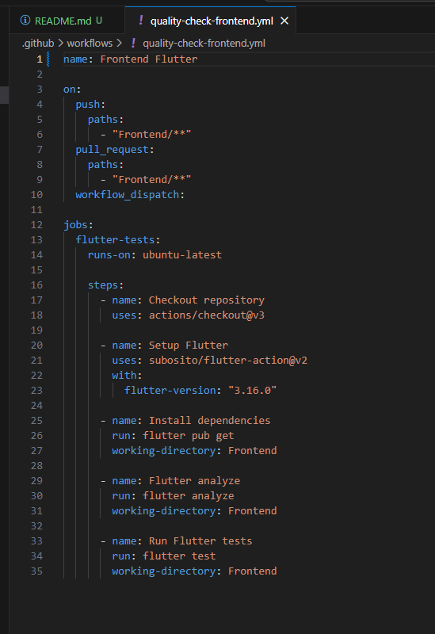
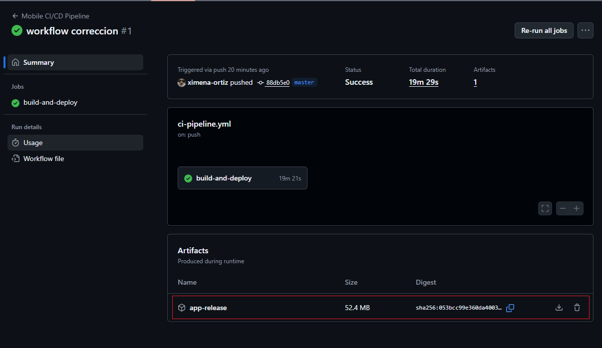

Soluciones Móviles II

## Examen Unidad 3 – Automatización con GitHub Actions

**Estudiante:** Ximena Ortiz Fernández

**Fecha:** 18 de Noviembre del 2025

**Repositorio:** [https://github.com/ximena-ortiz/SM2_ExamenUnidad3](https://github.com/ximena-ortiz/SM2_ExamenUnidad3)

---

### Pruebas Frontend

Se encuentran dentro de la carpeta test, dentro de cada uno se encuentran los diferentes tests implementados en el frontend del proyecto

---

### Pruebas Backend

Se encuentran dentro de src/test, dentro de este archivo se encuentran los test necesarios para el funcionamiento del backend

### Ejecución de Pruebas localmente

A nivel de frontend se ejecutarion las pruebas con el comando `flutter test`

EN el Backend primero se instalaron las dependencias con el comando `npm install` y luego se ejecutaron los tests con el comando `npm run test`

### Workflow en GitHub Actions (`.github/workflows/quality-check-frontend.yml`)

El workflow quality-check-frontend automatiza la validación del código del frontend desarrollado en Flutter cada vez que se realizan cambios en la carpeta Frontend/. Este flujo configura el entorno de Flutter, instala dependencias, analiza la calidad del código con flutter analyze y ejecuta las pruebas unitarias, garantizando que la aplicación móvil mantenga su correcto funcionamiento y buenas prácticas.

### Workflow en GitHub Actions (`.github/workflows/quality-check-backend.yml`)

El workflow quality-check-backend realiza integración continua sobre el backend en Node.js cuando se modifican archivos dentro de Backend/, instalando dependencias y ejecutando las pruebas definidas mediante npm test. Ambos workflows aseguran que tanto el frontend como el backend se mantengan estables, funcionales y libres de errores en cada actualización del repositorio.

### Ejecución Automática del Workflow

Para validar el funcionamiento automático:

1. Se realizó un commit a la rama `master`.
2. GitHub detectó el cambio y ejecutó el workflow automáticamente.
3. Se verificó la ejecución desde la pestaña Actions del repositorio.

---

### Explicación de lo Realizado

El proceso implementado asegura que cada modificación al proyecto se valide automáticamente:

### flutter analyze

Verifica que el código cumpla buenas prácticas y no contenga errores.

### flutter test

Ejecuta las pruebas unitarias para asegurar que las funciones clave siguen funcionando.

---

