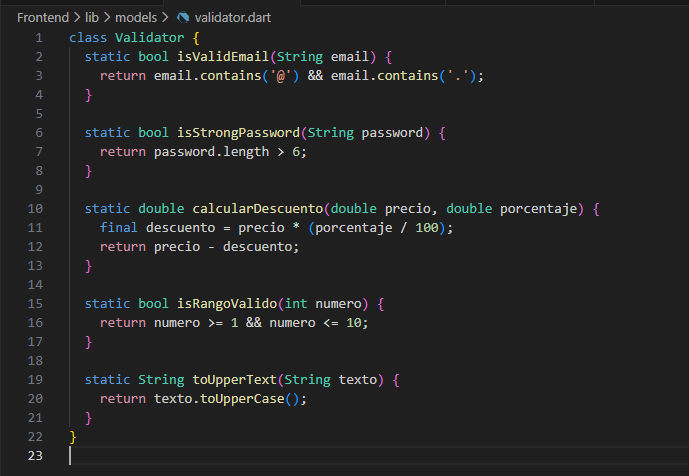
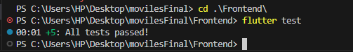

# SM2_Examen_CICD 

**Nombre:** Ximena Ortiz  
**Curso:** Soluciones Moviles II

 

---

## Repositorio

**URL del Repositorio:** [https://github.com/ximena-ortiz/SM2_Examen_CICD](https://github.com/ximena-ortiz/SM2_Examen_CICD)

---

## Parte 1: Lógica y Pruebas Unitarias

### Funciones Implementadas

Se creó la clase `Validator` con las siguientes funciones utilitarias:

| # | Función | Descripción | Criterio de Prueba |
|---|---------|-------------|-------------------|
| 1 | `isValidEmail()` | Valida formato de email | Retorna true si contiene "@" y "." |
| 2 | `isStrongPassword()` | Valida seguridad de contraseña | Retorna true si tiene más de 6 caracteres |
| 3 | `calcularDescuento()` | Calcula precio con descuento | Retorna el precio final después de aplicar el porcentaje |
| 4 | `isRangoValido()` | Valida rango numérico | Retorna true si el número está entre 1 y 10 (inclusive) |
| 5 | `toUpperText()` | Convierte texto a mayúsculas | Retorna el texto completamente capitalizado |

### Código de la Clase Validator

### Tests Unitarios

### Evidencia de Tests Locales

Los tests se ejecutaron localmente con el comando flutter test y todos pasaron exitosamente:

---

### Audite la calidad del código (Linting).

---

## Parte 2: Configuración del Pipeline CI/CD

### Workflow de GitHub Actions

Se configuró el archivo `.github/workflows/ci-pipeline.yml` con el siguiente contenido:

---

## Parte 3: Evidencias de Ejecución

### Badge de Estado del Pipeline

 

**Estado:** ✅ **Passing** - El pipeline se ejecuta correctamente en cada push.

### Evidencia de Tests Unitarios

El log de GitHub Actions muestra que los 5 tests unitarios pasaron exitosamente:

### Evidencia de Construcción y Artefacto

El APK se generó exitosamente y está disponible para descarga en la sección de Artifacts:

**Detalles del Artefacto:**
- **Nombre:** app-release
- **Formato:** APK 
- **Tamaño:** 52.4 MB

---

### Etapas del Pipeline

1. **Checkout Code:** Descarga el código fuente del repositorio
2. **Setup Flutter:** Configura el entorno Flutter 3.35.5
3. **Install Dependencies:** Ejecuta flutter pub get
4. **Code Quality Check:** Analiza el código con flutter analyze
5. **Run Unit Tests:** Ejecuta las pruebas unitarias con flutter test
6. **Build Application:** Compila el APK con flutter build apk
7. **Upload Artifact:** Sube el APK generado como artefacto descargable

---

